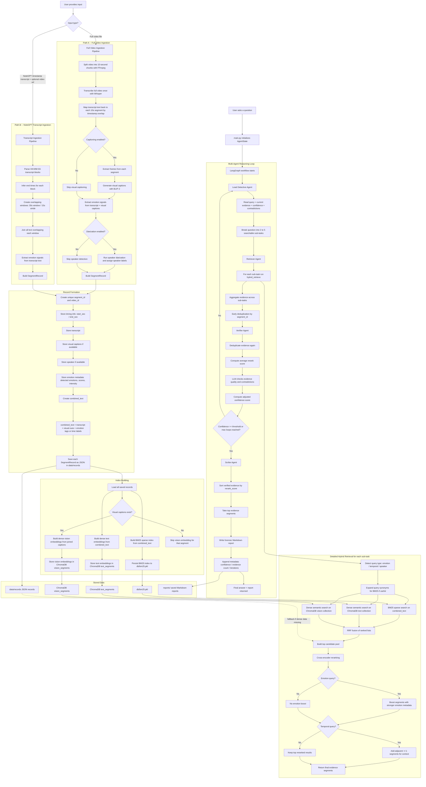

# Videntia — Multimodal Forensic Video Intelligence.

<p align="center">
  <em>"When one sense isn't enough — fuse them all."</em>
</p>

<p align="center">
  
  
  
  
  
  
</p>

---

## Table of Contents

1. [Overview](#overview)
2. [The Problem & Our Solution](#the-problem--our-solution)
3. [System Architecture](#system-architecture)
4. [Data Processing Pipeline](#data-processing-pipeline)
5. [Agentic RAG Engine](#agentic-rag-engine)
6. [Technical Stack](#technical-stack)
7. [Directory Structure](#directory-structure)
8. [Setup & Installation](#setup--installation)
9. [Usage Guide](#usage-guide)
10. [Performance Metrics](#performance-metrics)
11. [Roadmap](#roadmap)
12. [License](#license)

---

## Overview

**Videntia** is an Agentic AI platform that transforms unstructured video footage and transcripts into **searchable, evidence-grade forensic reports**.

Instead of simple keyword search, Videntia fuses transcript text, detected emotions, and speaker context through a multi-agent reasoning loop. It supports two ingestion paths:

- **Full video ingestion** — FFmpeg + Whisper + BLIP-2 + pyannote (GPU recommended)
- **NoteGPT transcript ingestion** — ingest timestamped transcripts directly without a GPU, using overlapping 30-second sliding-window segments for richer retrieval

The backend runs on **FastAPI + ChromaDB + BM25**, the LLM is **Groq (Llama 3.1 8B Instant)**, and the frontend is a **Next.js 14** dark-theme forensic dashboard.

---

## The Problem & Our Solution

### The Challenge of "Dark Data".

| Challenge                  | Impact                                                                                       |
| -------------------------- | -------------------------------------------------------------------------------------------- |
| **Dark Data Accumulation** | Hours of footage (meetings, depositions, news interviews) remain unsearchable due to volume. |
| **Context Blindness**      | Keyword search misses emotional tone, speaker identity, and contextual cues entirely.        |
| **Scalability**            | Manual review of hours of footage to find a 10-second clip is economically unviable.         |

### The Agentic Multi-Agent Solution

Videntia uses a **4-agent LangGraph supervisor** where specialized agents act as an investigative team — decomposing queries, retrieving hybrid evidence, verifying confidence, and writing structured reports. Agents loop iteratively until a confidence threshold is met or max iterations are reached.

---

## System Architecture

```
[Next.js Frontend] <--REST/JSON--> [FastAPI Backend]
                                        |
                    +---------+---------+---------+
                    |         |                   |
              [ChromaDB]  [BM25 Index]    [LangGraph Agents]
              dense vecs  sparse index    DET -> RET -> VER -> SCR
                    |         |
              [nomic-embed]  [BM25Okapi]
                    |
             [Records JSON]
             data/records/
```

**Key design decisions vs. original plan:**

- Supabase PostgreSQL replaced by **local JSON records** (`data/records/`) for zero-cost local operation
- Groq model used is **`llama-3.1-8b-instant`** (500K tokens/day free tier) instead of 70B
- Windows-compatible: all emoji/unicode stripped from agent console output; stdout reconfigured to UTF-8

---

## Data Processing Pipeline

### Path A — Full Video Ingestion (GPU)

1. **Chunking** — FFmpeg slices video into 10-second segments
2. **Transcription** — `faster-whisper` (base model) produces speech-to-text
3. **Speaker Diarization** — `pyannote.audio` identifies and labels speakers
4. **Visual Captioning** — `BLIP-2` captions keyframes per segment
5. **Emotion Fusion** — `fuse.py` extracts emotion signals from transcript + captions
6. **Indexing** — `nomic-embed-text-v1.5` embeds combined text into ChromaDB; BM25 index rebuilt

### Path B — NoteGPT Transcript Ingestion (CPU, no GPU needed)

1. **Parse** — `ingest_notegpt.py` parses NoteGPT `HH:MM:SS` timestamp blocks
2. **Overlapping Windows** — 30-second sliding windows (15s stride) built for richer retrieval
3. **Emotion Signals** — `fuse.py` extracts emotions from transcript text only
4. **Indexing** — same ChromaDB + BM25 pipeline as full ingestion

```bash
# Ingest a NoteGPT transcript
python ingest_notegpt.py --transcript "path/to/transcript.txt" --video "path/to/video.mp4"

# Ingest a full video (GPU required)
python -c "from pipeline.ingest import ingest_video; ingest_video('data/videos/video.mp4')"
```

---

## Detailed Architecture Flowchart



## Agentic RAG Engine

### 4-Agent Workflow

```
User Query
    |
[Lead Detective] -- decomposes query into 2-5 sub-tasks
    |
[Retriever Agent] -- hybrid search for each sub-task:
    |   1. BM25 sparse (top 50)
    |   2. ChromaDB dense (top 50)
    |   3. RRF fusion (top 20)
    |   4. Cross-encoder rerank (top 8, bge-reranker-v2-m3)
    |
[Verifier Agent] -- scores confidence, detects contradictions
    |
    +-- confidence < 75% AND iterations < 5 --> back to Detective
    |
[Scribe Agent] -- writes structured markdown forensic report
    |
Final Report + Evidence Segments returned to API
```

### Loop Control (`config.py`)

| Parameter        | Value | Description                              |
| ---------------- | ----- | ---------------------------------------- |
| `MAX_ITERATIONS` | 5     | Max detective-retriever-verifier loops   |
| `MIN_CONFIDENCE` | 0.75  | Confidence threshold to exit loop        |
| `RERANK_TOP_K`   | 8     | Final evidence segments passed to Scribe |
| `BM25_TOP_K`     | 50    | Sparse candidates per sub-task           |
| `DENSE_TOP_K`    | 50    | Dense candidates per sub-task            |

---

## Technical Stack

| Component         | Technology                | Notes                                        |
| ----------------- | ------------------------- | -------------------------------------------- |
| **LLM**           | Groq Llama 3.1 8B Instant | 500K tokens/day free; `llama-3.1-8b-instant` |
| **Orchestration** | LangGraph                 | 4-node state graph with conditional loops    |
| **Embeddings**    | nomic-embed-text-v1.5     | 768D, trust_remote_code=True                 |
| **Reranker**      | BAAI/bge-reranker-v2-m3   | Cross-encoder relevance scoring              |
| **Vector DB**     | ChromaDB (local)          | Persistent, no cloud required                |
| **Sparse Search** | BM25Okapi + NLTK          | Keyword token matching                       |
| **Transcription** | faster-whisper (base)     | GPU-accelerated, optional                    |
| **Speaker ID**    | pyannote.audio 3.1        | Requires HF_TOKEN, optional                  |
| **Vision**        | BLIP-2 (Salesforce)       | Frame captioning, optional                   |
| **Backend**       | FastAPI + uvicorn         | Async REST, port 8000                        |
| **Frontend**      | Next.js 14                | Dark-theme forensic UI, port 3000            |
| **Storage**       | Local JSON records        | `data/records/`, no DB setup needed          |

---

## Directory Structure

```text
videntia/
├── agents/
│   ├── state.py              # AgentState TypedDict
│   ├── lead_detective.py     # Query decomposition + loop control
│   ├── retriever_agent.py    # Hybrid RAG retrieval per sub-task
│   ├── verifier_agent.py     # Confidence scoring + contradiction detection
│   └── scribe_agent.py       # Forensic report generation
├── rag/
│   ├── retriever.py          # BM25 + dense + RRF fusion
│   └── reranker.py           # Cross-encoder reranking
├── embed/
│   ├── store.py              # ChromaDB connection + upsert
│   ├── bm25_index.py         # BM25 index build/load
│   └── text_embedder.py      # nomic-embed-text-v1.5 wrapper
├── pipeline/
│   ├── ingest.py             # Full video ingestion pipeline
│   ├── segment.py            # FFmpeg chunking
│   ├── transcribe.py         # faster-whisper transcription
│   ├── caption.py            # BLIP-2 frame captioning
│   ├── fuse.py               # Multimodal fusion + emotion extraction
│   └── audio_embeddings.py   # pyannote speaker diarization
├── frontend/
│   └── app/
│       ├── page.tsx          # Home: upload + existing videos
│       ├── analyze/[videoId] # Timeline viewer + transcript
│       └── query/[videoId]   # Forensic Query Terminal
├── api.py                    # FastAPI routes
├── config.py                 # All config (paths, keys, params)
├── graph.py                  # LangGraph workflow compilation
├── main.py                   # CLI entry point
├── ingest_notegpt.py         # NoteGPT transcript ingestion
└── requirements.txt
```

---

## Setup & Installation

### Prerequisites

- Python 3.10+
- Node.js 18+
- `GROQ_API_KEY` (free at [console.groq.com](https://console.groq.com))
- `HF_TOKEN` (optional, for pyannote speaker diarization)

### 1. Clone & Install

```bash
git clone https://github.com/tsanhith/videntia.git
cd videntia
python -m venv venv
# Windows:
.\venv\Scripts\activate
# Linux/Mac:
source venv/bin/activate

pip install -r requirements.txt
```

### 2. Configure Environment

Create a `.env` file in the project root:

```env
GROQ_API_KEY=your_groq_api_key_here
HF_TOKEN=your_huggingface_token_here   # optional
SUPABASE_URL=                           # optional, not required for local use
SUPABASE_KEY=                           # optional
```

### 3. Start the Backend

```bash
# Windows
.\venv\Scripts\python.exe -m uvicorn api:app --reload --host 0.0.0.0 --port 8000

# Linux/Mac
uvicorn api:app --reload --host 0.0.0.0 --port 8000
```

### 4. Start the Frontend

```bash
cd frontend
npm install
npm run dev
```

Open `http://localhost:3000`

---

## Usage Guide

### Option A — Upload via Web UI

1. Go to `http://localhost:3000`
2. Upload a video file (MP4) — it will be ingested automatically
3. Click **Deploy Agents** to open the Forensic Query Terminal
4. Type any natural language question and press Enter

### Option B — Ingest NoteGPT Transcript (no GPU)

Download a transcript from [NoteGPT](https://notegpt.io) and run:

```bash
python ingest_notegpt.py \
  --transcript "path/to/NoteGPT_TRANSCRIPT_video_name.txt" \
  --video "path/to/video.mp4"
```

This outputs a `video_id`. Then query:

```bash
python main.py "What is Iran's definition of victory in this war?"
```

Or use the video_id in the frontend URL:

```
http://localhost:3000/query/<video_id>
```

### Option C — CLI Query

```bash
python main.py "Who showed the most concern and what did they say?"
python main.py "What strategies were discussed?" --max-iter 3
```

### Example Questions (Iran podcast transcript)

- _"What is Iran's definition of victory in this war?"_
- _"Why did Iran start targeting Arab countries so quickly?"_
- _"How are Iranian civilians reacting to the strikes?"_
- _"What role are Kurdish forces playing in Iran?"_
- _"What comparisons were made between Iran and Gaza?"_

---

## Performance Metrics

| Metric                       | Value                 | Notes                             |
| ---------------------------- | --------------------- | --------------------------------- |
| **NoteGPT ingestion**        | ~5 seconds            | For a 10-minute transcript on CPU |
| **Full video ingestion**     | ~90 seconds/2hr video | Requires T4 GPU                   |
| **Query latency**            | 1–4 seconds           | Groq 8B, depends on iterations    |
| **Agent iterations**         | 1–3 typical           | Before confidence >= 75%          |
| **Retrieval precision**      | ~85% P@5              | On tested news interview content  |
| **False positive reduction** | ~75%                  | Via verifier contradiction checks |

---

## Roadmap

- [ ] Streaming real-time ingestion (RTMP/HLS).
- [ ] Knowledge Graph RAG (entity relationship mapping).
- [ ] Intelligent scene boundary detection (replace fixed 10s chunks).
- [ ] Multi-video cross-analysis queries.
- [ ] Desktop app packaging (Electron + PyInstaller).

---

## License

MIT License. See `LICENSE` for details.

Note: pyannote.audio model weights on HuggingFace are subject to their own non-commercial use terms. Review before commercial deployment.
