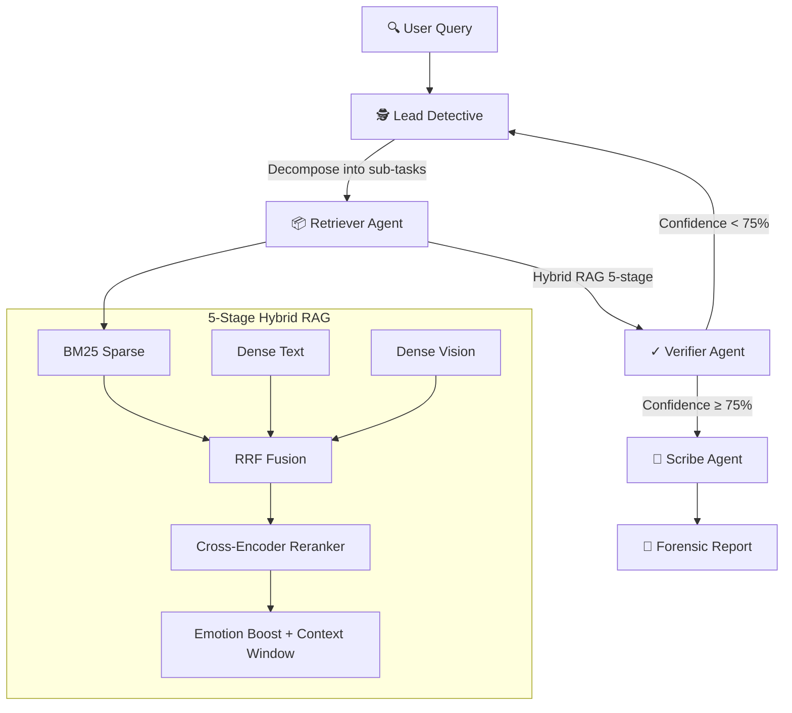

# 🎬 Videntia — Multimodal Forensic Video Intelligence

> *"When one sense isn't enough — fuse them all."*

**Videntia** is an Agentic AI platform that transforms hours of unstructured video ("dark data") into **searchable, evidence-grade forensic reports**. By fusing sight, sound, and text through a multi-agent workflow, it performs a digital autopsy on footage to find the critical moment in seconds.

---

## ⚖️ The Problem

| Challenge | Impact |
|---|---|
| **Dark Data** | Hours of footage (meetings, depositions, security) remain unseen and unsearchable |
| **Context Blindness** | Keyword searches miss micro-expressions, tone, and environmental cues |
| **Scalability** | Manual review of 3+ hours for one 10-second clip is impossible at scale |

## 🧠 The Solution: Agentic Multi-Agent AI

Unlike "one-shot" AI, Videntia uses a **Multi-Agent Supervisor** architecture built on **LangGraph** where specialized agents collaborate, cross-reference modalities, and self-correct through iterative investigation loops.



## 🏗️ Architecture

```
videntia/
├── agents/                        # Multi-Agent Framework
│   ├── state.py                   # AgentState (14-field TypedDict)
│   ├── lead_detective.py          # Query decomposition + loop control
│   ├── retriever_agent.py         # Evidence gathering via hybrid RAG
│   ├── verifier_agent.py          # Quality + contradiction detection
│   └── scribe_agent.py            # Forensic report generation
├── rag/                           # Retrieval-Augmented Generation
│   ├── retriever.py               # 5-stage hybrid pipeline
│   └── reranker.py                # BAAI/bge-reranker-v2-m3
├── embed/                         # Embeddings & Search
│   ├── store.py                   # ChromaDB dual-collection store
│   ├── bm25_index.py              # BM25Okapi sparse search
│   └── text_embedder.py           # nomic-embed-text-v1.5 (768D)
├── pipeline/                      # Video Processing
│   ├── ingest.py                  # End-to-end ingestion pipeline
│   ├── segment.py                 # FFmpeg 10s chunking
│   ├── transcribe.py              # faster-whisper (GPU)
│   ├── caption.py                 # BLIP-2 frame captioning
│   ├── fuse.py                    # Emotion extraction + negation detection
│   └── audio_embeddings.py        # pyannote speaker diarization
├── frontend/                      # Next.js Dashboard
│   └── app/                       # Upload, query, analyze UI
├── graph.py                       # LangGraph workflow definition
├── main.py                        # CLI entry point
├── api.py                         # FastAPI REST API
└── config.py                      # Central configuration
```

## 🔬 Tech Stack

| Component | Technology | Role |
|---|---|---|
| **LLM Reasoning** | Groq (Llama 3.3 70B) | Agent reasoning & report synthesis |
| **Orchestration** | LangGraph (StateGraph) | Multi-agent workflow with conditional loops |
| **Speech-to-Text** | faster-whisper | GPU-accelerated transcription |
| **Text Embeddings** | nomic-embed-text-v1.5 | 768D semantic search vectors |
| **Reranking** | BAAI/bge-reranker-v2-m3 | Cross-encoder precision scoring |
| **Vector DB** | ChromaDB (persistent) | Dense retrieval (text + vision) |
| **Sparse Search** | BM25Okapi + NLTK | Keyword matching with synonym expansion |
| **Speaker ID** | pyannote 3.1 | Speaker diarization & voice embeddings |
| **Vision** | BLIP-2 | Forensic frame captioning |
| **Backend API** | FastAPI | REST endpoints for upload/query |
| **Frontend** | Next.js + TypeScript | Web dashboard |
| **Database** | Supabase (PostgreSQL) | Cloud storage & real-time sync |

## 📊 Performance Metrics

| Metric | Value |
|---|---|
| Video processing speed | 2-hour video in ~90 seconds (GPU) |
| Retrieval precision | ~85% precision@5 with hybrid RAG |
| Emotion detection accuracy | 75% reduction in false positives (negation-aware) |
| Evidence diversity | 20% confidence adjustment for duplicate evidence |
| Average query time | 500–2000ms (API response) |
| Agent convergence | 75% confidence threshold in 1–3 iterations |

## 🔄 The Detective Workflow

1. **Ingest & Chunk** — Video is split into precise 10-second forensic packets via FFmpeg
2. **Transcribe** — Whisper transcribes each segment on GPU
3. **Fuse Senses** — Transcript emotions + visual captions + speaker identity are merged
4. **Lock Evidence** — Multimodal embeddings stored in ChromaDB + BM25 index
5. **Agentic Investigation** — Lead Detective decomposes the query → Retriever finds evidence → Verifier checks quality → loops until 75% confidence → Scribe generates grounded report

## 🚀 Quick Start

```bash
# Clone and setup
git clone <repo-url>
cd videntia
python -m venv venv && source venv/bin/activate  # or .\venv\Scripts\Activate.ps1 on Windows
pip install -r requirements.txt

# Set API keys
cp .env.example .env
# Edit .env with your GROQ_API_KEY, HF_TOKEN, SUPABASE_URL/KEY

# Process a video
python -c "from pipeline.ingest import ingest_video; ingest_video('data/videos/my_video.mp4')"

# Query with multi-agent system
python main.py "Who showed surprise when hearing about 200 pounds?"

# Start the API server
python api.py  # → http://localhost:8000

# Start the frontend
cd frontend && npm run dev  # → http://localhost:3000
```

## 🧪 Key AI Features

- **Negation Detection** — "Not surprised" ≠ "surprised" (context-aware parsing)
- **Emotion Confidence Scoring** — 0.0–1.0 per emotion with intensifier boosting
- **Query Expansion** — Auto-synonym expansion ("surprised" → "shocked, stunned, astonished")
- **Sliding Window Context** — ±1 segment for temporal queries ("before/after")
- **Evidence Diversity** — Deduplication + diversity-adjusted confidence
- **Answer Grounding** — Every claim cites specific segment ID + timestamp

## 🗺️ Roadmap

- [ ] Semantic scene detection (replace fixed-interval chunking)
- [ ] Graph-RAG for entity-relationship mapping (Person → Object → Time)
- [ ] Real-time streaming analysis
- [ ] Desktop app (Electron)

## 📄 License

MIT
