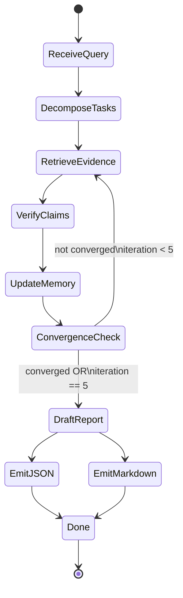
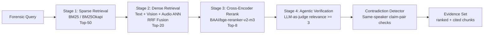

# Videntia Architecture, Flows, and Repository Structure

This document converts the blueprint into Mermaid diagrams so implementation and thesis documentation stay aligned.

## 1) End-to-End System Architecture

```mermaid
flowchart TB
  subgraph ING[Ingestion Pipeline]
    V[Input Video]
    SEG[FFmpeg Segmenter\n10s windows + 2s overlap]
    A[Audio Stream]
    F[Frame Stream]
    T[Transcript Stream]

    W[faster-whisper STT]
    D[pyannote diarization]
    C[CLIP / BLIP-2]
    O[Tesseract OCR]

    MUX[Multimodal Fusion\nSegment Record\n{text, vision, audio, speaker, timestamps, metadata}]

    V --> SEG
    SEG --> A
    SEG --> F
    SEG --> T

    A --> W
    A --> D
    F --> C
    F --> O
    T --> MUX
    W --> MUX
    D --> MUX
    C --> MUX
    O --> MUX
  end

  subgraph IDX[Embedding and Indexing]
    ET[Text Embeddings\n(nomic-embed-text / BGE-M3)]
    EV[Vision Embeddings\n(CLIP ViT-L/14)]
    EA[Audio Embeddings\n(CLAP)]

    CH[(ChromaDB\nMulti-Collection)]
    CT[(text_segments)]
    CV[(vision_segments)]
    CA[(audio_segments)]
    CF[(fused_summaries)]

    MUX --> ET
    MUX --> EV
    MUX --> EA

    ET --> CH
    EV --> CH
    EA --> CH

    CH --> CT
    CH --> CV
    CH --> CA
    CH --> CF
  end

  subgraph AGT[Multi-Agent Reasoning Loop]
    Q[User Query / Forensic Task]
    LD[Lead Detective\nOrchestrator]
    RT[Retriever Agent]
    VF[Verifier Agent]
    MM[Memory Manager]
    FL[(Fact Ledger)]
    RS[Report Scribe]
    OUT[Structured Report\nJSON + Markdown]

    Q --> LD
    LD --> RT
    LD --> VF
    LD --> MM

    RT --> LD
    VF --> LD
    MM --> LD

    VF --> FL
    MM --> FL
    FL --> RS
    LD --> RS
    RS --> OUT
  end

  CH --> RT
```

## 2) Multi-Agent Loop (State Machine)



## 3) Hybrid RAG Retrieval Flow



## 4) Suggested Repository Structure

```mermaid
flowchart TB
  R[videntia/]

  R --> A1[README.md]
  R --> A2[docs/]
  R --> A3[src/]
  R --> A4[scripts/]
  R --> A5[configs/]
  R --> A6[data/]
  R --> A7[artifacts/]
  R --> A8[tests/]

  A2 --> D1[FREE_BUILD_PLAN.md]
  A2 --> D2[ARCHITECTURE_AND_FLOWS.md]

  A3 --> S1[ingestion/\nsegmenter, stt, diarization, keyframes, ocr]
  A3 --> S2[embeddings/\ntext, vision, audio encoders]
  A3 --> S3[retrieval/\nbm25, dense, rrf, reranker]
  A3 --> S4[agents/\nlead_detective, retriever, verifier, memory, scribe]
  A3 --> S5[memory/\nworking + long_term stores]
  A3 --> S6[reporting/\njson + markdown emitters]
  A3 --> S7[api/\nfastapi endpoints]

  A4 --> P1[run_ingestion.py]
  A4 --> P2[run_indexing.py]
  A4 --> P3[run_query.py]

  A6 --> D3[raw_videos/]
  A6 --> D4[segments/]
  A6 --> D5[transcripts/]
  A6 --> D6[keyframes/]
  A6 --> D7[ocr/]

  A7 --> T1[chroma/]
  A7 --> T2[reports/]
  A7 --> T3[logs/]

  A8 --> T4[test_retrieval.py]
  A8 --> T5[test_agents.py]
```



## 5) Forensic Segment Record Shape

```json
{
  "segment_id": "vid001_t0060_t0070",
  "video_id": "vid001",
  "start_sec": 60,
  "end_sec": 70,
  "transcript": "...",
  "speakers": {
    "60:62": "SPEAKER_00",
    "62:67": "SPEAKER_01"
  },
  "visual_captions": [
    "A man in a blue jacket gestures at a document"
  ],
  "ocr_text": "CONTRACT EXHIBIT A",
  "keyframe_paths": [
    "data/keyframes/vid001_t60_f1.jpg"
  ],
  "embeddings": {
    "text": "...",
    "vision": "...",
    "audio": "..."
  }
}
```

## 6) Notes for Thesis Traceability

- Keep per-claim citation fields in report outputs (`segment_id`, `timestamp`, `modality`, `confidence`).
- Preserve raw retrieval rankings at each stage so ablation analysis is reproducible.
- Version the fusion strategy configuration (fixed RRF vs adaptive weighted fusion).
